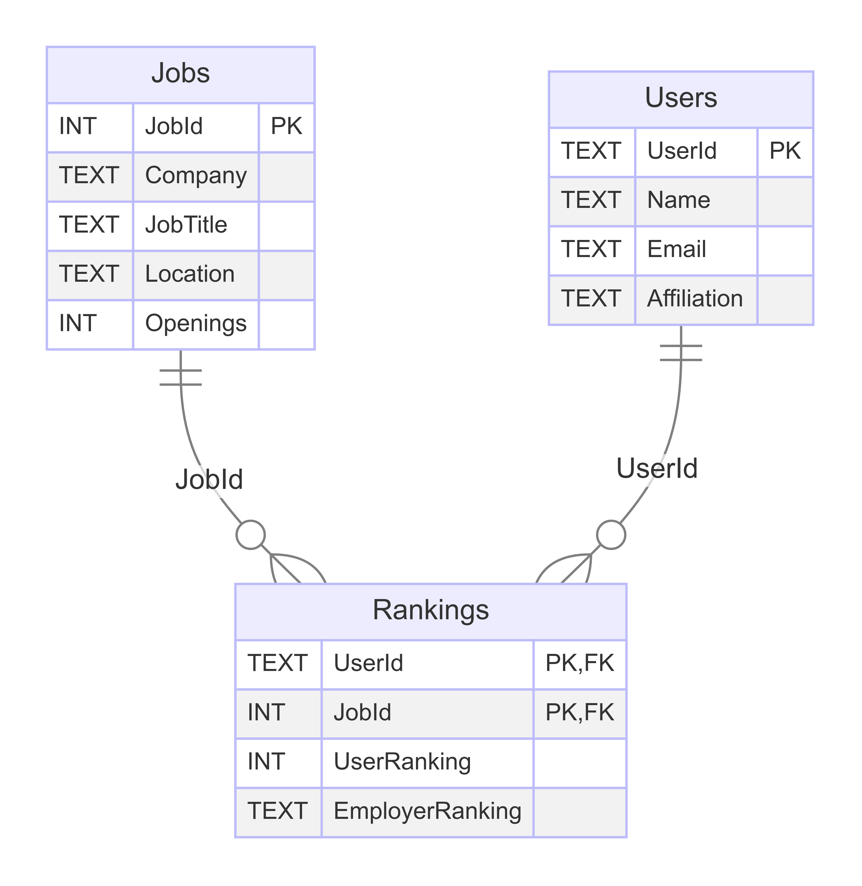

# Rankings.fyi Database

## Setup
1. Make a copy of `.env.example` and call it `.env`. Change the env vars.
2. Run `./init.sh`.
3. Run `./connect.sh` to hop into the shell.

## Design Choices
- All string fields are TEXT -> change later to VARCHAR
- User ranking is an INT following the same convention as is on the WaterlooWorks form
    - 0 -> pending
    - 1-10 -> rank
    - 99 -> not interested
- Employer ranking is currently a text field to support '1' or 'Ranked' or 'Not Ranked' but should be changed later to an int or something.
- Constraints are in a separate files, but could be moved in with create_tables

## ER Diagram

